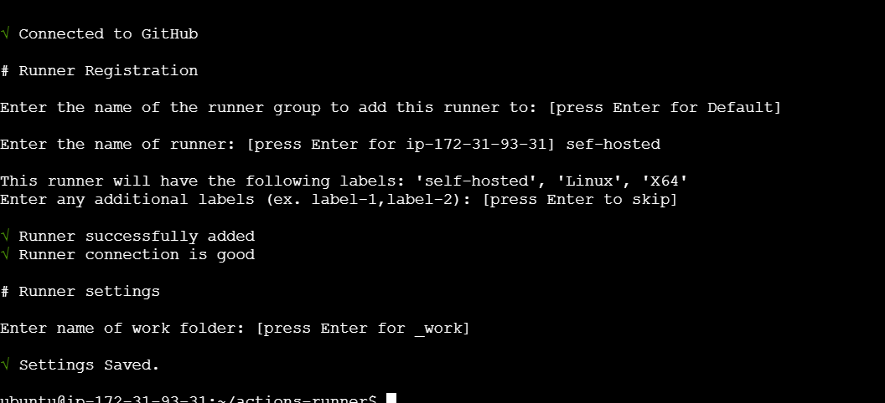

# MLOps Project

## How to run?

```bash
python -m venv venv
source venv/bin/activate
pip install -r requirements.txt
dvc repro
```

---

## DVC Commands

```bash
git init
dvc init
dvc repro
dvc dag
dvc metrics show
```

---

## Git & Github for MLOps

```bash
git status
git add test.py
git add .
git rm --cached test.py
git commit -m "updated"

# To check branch
git branch

# Create a new branch
git checkout -b bappy

# Switch the branch
git checkout main

# Merge the branch
git merge bappy
git pull
```

---

## Docker Test

```bash
docker pull hello-world
docker run hello-world
docker ps                                   # See a list of all running containers
docker ps -a                                # See a list of all containers, even the ones not running
docker rm <hash>                            # Remove the specified container from this machine
docker rm $(docker ps -a -q)                # Remove all containers from this machine
docker images -a                            # Show all images on this machine
docker rmi <imagename>                      # Remove the specified image from this machine
docker rmi $(docker images -q)              # Remove all images from this machine
```

### Docker Custom image

```bash
docker build -t name:latest .
docker run -p 8080:8080 name:latest
docker run -d -p 8080:8080 name:latest
```

### Push to Docker Hub:

```bash
docker login
docker push name:latest
```

---

## AWS-CICD-Deployment-with-Github-Actions:

1.  Login to AWS console.
2.  Create IAM user for deployment
    -   with specific access
        1.  EC2 access : It is virtual machine
        2.  ECR: Elastic Container registry to save your docker image in aws

### Description: About the deployment

1.  Build docker image of the source code
2.  Push your docker image to ECR
3.  Launch Your EC2
4.  Pull Your image from ECR in EC2
5.  Lauch your docker image in EC2

### Policy:

1.  `AmazonEC2ContainerRegistryFullAccess`
2.  `AmazonEC2FullAccess`
3.  Create ECR repo to store/save docker image
    -   `495403531064.dkr.ecr.us-east-1.amazonaws.com/anuragmlproject`
4.  Create EC2 machine (Ubuntu)
5.  Open EC2 and Install docker in EC2 Machine:

    **Optional**

    ```bash
    sudo apt-get update -y
    sudo apt-get upgrade
    ```

    **Required**

    ```bash
    curl -fsSL https://get.docker.com -o get-docker.sh
    sudo sh get-docker.sh
    sudo usermod -aG docker ubuntu
    newgrp docker
    ```

---

## Configuration for Github Actions

Commands from gitrepo>settings>actions>runners>addnewselfhostedrunner>linux

Commands:

-   Download
-   configure

Run these commands in the vm(Ec2 Instance)



---

6.  **Configure EC2 as self-hosted runner:**

    `setting>actions>runner>new self hosted runner> choose os> then run command one by one`

7.  **Setup github secrets:**

    ```
    AWS_ACCESS_KEY_ID=
    AWS_SECRET_ACCESS_KEY=
    AWS_REGION = us-east-1
    AWS_ECR_LOGIN_URI = demo>>  566373416292.dkr.ecr.ap-south-1.amazonaws.com
    ECR_REPOSITORY_NAME = simple-app
    ```
